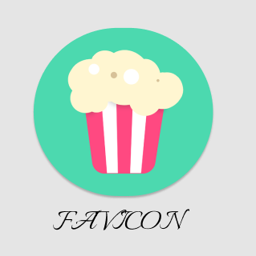

# FilmRelax :movie_camera:
We have a REST API and our Stackholder wants a website with movies to relax, 
it will be used by his workers and family and it will be called FilmRelax."
=======
# FilmCity Relax 🍿

People who want to disconnect and relax watching videos and movies.
Workers and family members in need of day-to-day relaxation

=======
# Functionalities :floppy_disk:

- See all the movies in the Frontend

# Tools :computer:

- Git / Github
- Trello
- IntelliJ IDEA
- Spring Boot
- Java 
- JSON
- Visual Code Studio

# Authors ✒️
- Iris Vilaseca Sáenz de Santamaría - https://github.com/irisvilaseca
- Carlos Laurie Díaz - https://github.com/CarlitosHunter
- Miguel Ángel Íñiguez Pérez - https://github.com/maip202
- Raquel Castro Fernández - 
- Beatriz Robledillo Gómez - https://github.com/BeitxuelaWEB

# Greetings :gift:
- Comment your friends and colleagues about this project. :loudspeaker:
- Thank the team. :slightly_smiling_face:
- Invite the team for a beer. :beer:

